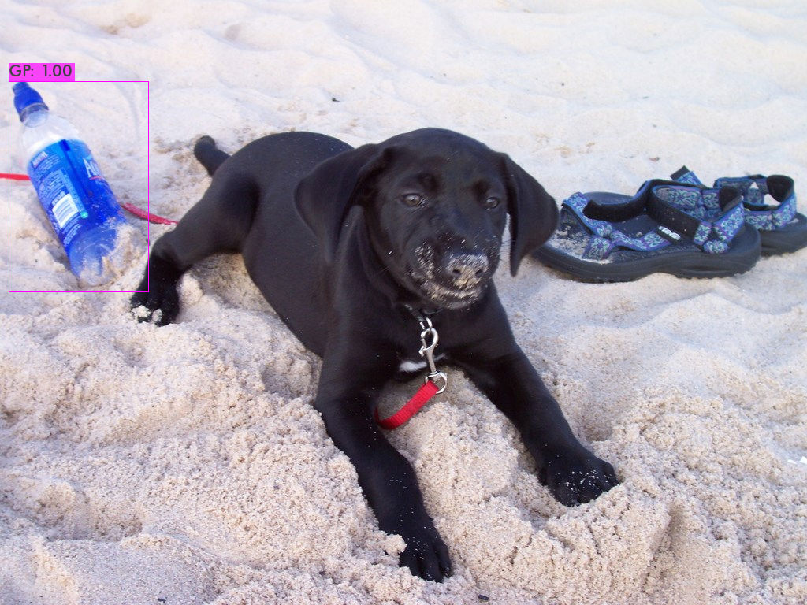

# YOLOv4 - Detecção de Garrafa Plástica

Este repositório é um auxiliar para o Colab que foi desenvolvido para o projeto de detectar garrafas plásticas.
Devido aos arquivos serem muito grandes, este repositório possui apenas os arquivos e pastas padrões necessários para executar o código. Caso deseje utilizar para um novo projeto, basta substituir e configurar conforme detalhado no Colab.

Caso deseje saber mais sobre o projeto:

Colab: https://colab.research.google.com/drive/1zLJuAJa0dg3-KQKtLzASzAV-VkPYN_bx?usp=sharing

Vídeo do projeto: https://youtu.be/PtXPh4BEAAI

